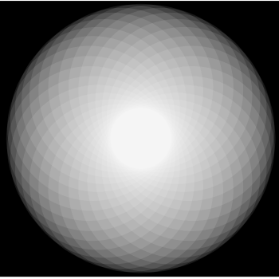
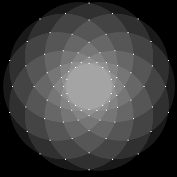
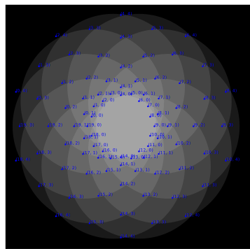
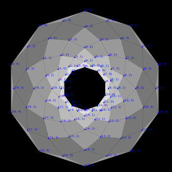
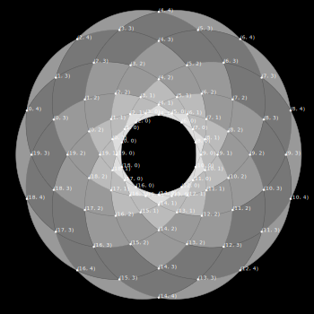

# It Started with the Mosta Dome...

While on a trip to [Malta](https://www.google.ca/maps/place/Malta/@35.9440174,14.3795242,11z/data=!3m1!4b1!4m2!3m1!1s0x130e45281d8647c5:0xf582d86136be4239) several years ago, I took a look inside a wild and wonderful church to see what is one of the largest domes in Europe.  I was struck by the geometric pattern of the inside of the dome, which I found mesmerizing.

This pattern has apparently wormed its way inside my brain, even showing up in my abstract paintings:

*[Full Image](http://sethdavenport.com/#/lightbox/gallery/4/image/94)*

So, I wanted to explore further how to manipulate this type of geometry to produce compelling armatures for future paintings.  Of course, constructing geometry this complex with pencil and compass is time-consuming.  I needed a test bed to experiment with the forms and colours prior to committing tons of expensive materials.

The developer side of my brain came up with a winning formula:

# AngularJS + SVG == [Amaazing!](http://rawgit.com/DietCokeOfEvil/visualizations/master/rosette.html)

JavaScript and SVG gave me the ability to quickly prototype variations on this pattern, as long as I could crack the geometry.  Angular's data-binding, while a bit slow, made it easy to express repetitive geometries with a declarative syntax.  What I wanted to do was get some code to generate the pattern seen in the dome as SVG.

## First Attempt

The 'rosette' pattern above can be easily expressed as a set of circles whose centres lie at regular intervals around the perimeter of a 'guide circle'.  The figure below is an SVG render of 32 such overlapping circles, each with partial opacity so the overlapping areas appear as distinct cells in the pattern.

This is cheap to render, and shows the pattern in a basic way quite easily.  However, in order to draw something more like the Mosta dome or painting images above, I need to be able to manipulate the pattern cells individually; this means that I need a way to compute the location of each 3-or-4-sided cell.

## Towards a Cell-Based Render

The first step is to compute the vertexes that define each cell.  This can be thought of as computing all the points where the circles intersect each other.

Fortunately the formula for the instersecton points of two circles is pretty easy to derive with [some basic algebra](http://mathforum.org/library/drmath/view/51836.html).  I just had to code it up and compute each circle's intersection with the other (n-1) circles.

Here's a render of a 10-circle rosette with the intersection points identified and plotted separately.

## Coordinating the Vertices

Having a set of intersection points is all fine and dandy, but I need to identify subsets of these points that bound each cell.  First, this means logically assigning some kind of ordering to the set of points.  I chose to think of the points in terms of a warped grid, in which the points form radials away from the centre of the rosette.  In this way, 'x' can be defined as the radial upon which the point lies, and 'y' can be defined as the distance from the centre.

In this way, I can use trigonometry to calculate each vertex's angle and distance with respect to the centre, and then organize the set of vertices according to these in discrete increments.  The following image shows the same points labeled with their coordinates in this new system.

Once this is done, it becomes fairly trivial to organize the points into polygons and render them as SVG paths, either flat or using arc segments with the same radius as the original overlapping circles.  At this point, I can dispense with the circle render completely, since I have a reasonable approximation made up of individual cells.

## Centroid Central

## Inlay Draw Modes

## Final Renders